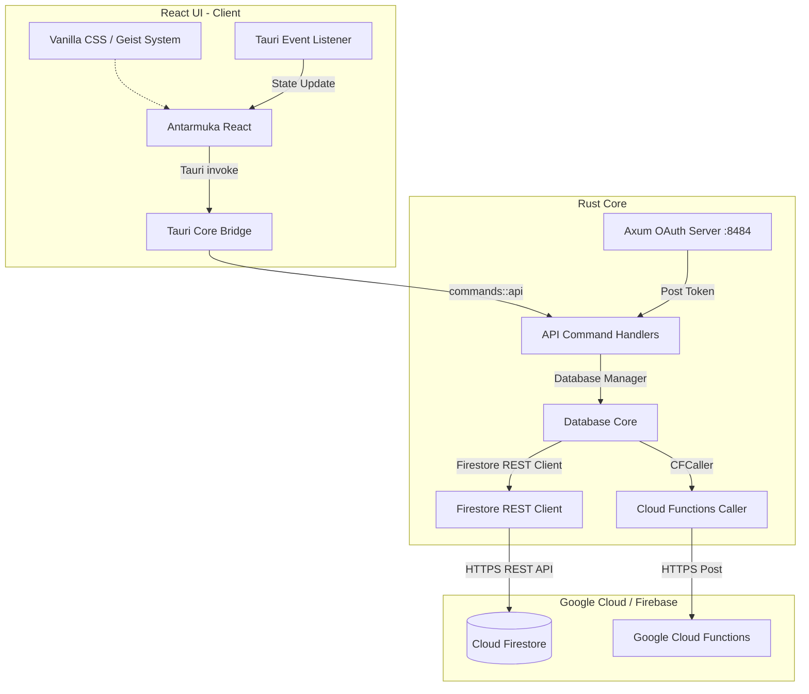
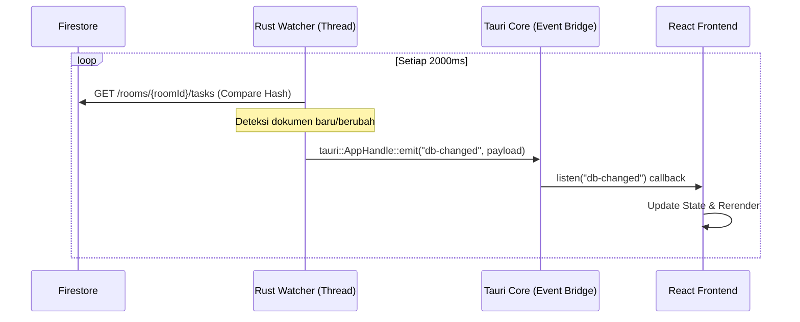

# Dokumentasi Arsitektur, Analisis Sistem, & Peta Jalan Masa Depan — Syncology
> Versi: 2.1.0 | Penulis: Antigravity | Tanggal: 13 Juli 2026

Aplikasi Syncology merupakan hasil migrasi dari platform desktop lama Python (PySide6) ke **Rust + Tauri v2** dengan frontend **React (Vite) + Vanilla CSS**. 

Dokumen ini memuat analisis mendalam arsitektur sistem saat ini, identifikasi kesenjangan teknis pasca-migrasi, penjelasan detail sub-sistem autentikasi loopback, serta rancangan teknis untuk fitur kolaborasi tim yang akan datang (seperti chat room/task, real-time watchers, notifikasi desktop native, dan penanganan bukti file).

---

## 🗺️ 1. Arsitektur Aliran Data & Sub-sistem Loopback

Aplikasi ini menggunakan pola komunikasi **Asynchronous Bridge** antara UI dan Sistem Operasi melalui Tauri IPC (Inter-Process Communication).



### 🔐 Sistem Autentikasi Loopback Axum (Lokal Callback)
Tauri tidak dapat secara langsung menangani redirect URI OAuth Google yang memerlukan penanganan HTTP protocol di localhost. Oleh karena itu, aplikasi mengimplementasikan server HTTP mikro di backend Rust menggunakan **Axum**:

1. **Pemicu**: Pengguna mengeklik tombol **Sign in with Google** di UI.
2. **Server Lokal**: Rust mengikat (`bind`) TcpListener lokal pada alamat `127.0.0.1:8484` dan menjalankan router Axum di background thread.
3. **Loopback**: Rust membuka browser bawaan OS ke alamat `http://localhost:8484/` menggunakan pustaka `open`.
4. **Firebase SDK**: Halaman HTML lokal yang disajikan Axum menginisialisasi Firebase SDK di sisi browser, memicu Google OAuth pop-up, dan mengambil `idToken` Firebase setelah pengguna berhasil masuk.
5. **Koleksi Token**: Browser mengirimkan payload JSON token ke endpoint `/token` Axum melalui metode POST.
6. **Sinkronisasi**: Server Axum menyimpan data user ke mutex thread-safe, menembakkan sinyal `Notify` untuk mematikan TcpListener secara otomatis, dan mengembalikan token ke thread utama Tauri.
7. **Penyebaran**: Token dipropagasikan ke client Firestore (`db.set_token`) dan Cloud Functions (`cf.set_token`).

---

## 🕵️ 2. Analisis Kesenjangan Sistem (Python vs Rust+React)

Selama proses analisis komparatif kode Python lama (`database.py`) dengan implementasi Tauri React saat ini, diidentifikasi kesenjangan arsitektur berikut:

### 🔄 Real-time Watchers (Watcher)
- **Pada Python**: Memiliki kelas `Watcher` yang berjalan di thread terpisah, melakukan jajak pendapat (polling) HTTP REST ke Firestore setiap `2000ms`, membandingkan hash dokumen, dan memicu callback UI jika terjadi perubahan.
- **Pada Rust+React saat ini**: Data hanya di-load sekali ketika komponen React di-mount atau ketika user secara sadar memicu aksi (seperti sesaat setelah propose task baru).
- **Dampak**: Jika anggota tim lain memperbarui status tugas (misal mengirim bukti pengerjaan), UI pengguna lain tidak akan ter-update secara otomatis sampai mereka berpindah tab atau me-refresh aplikasi.

### 🧩 Kudos System
- **Pada Python**: Field kudos telah terstruktur namun pada UI lama hanya dirender sebagai placeholder `0`.
- **Pada Rust+React saat ini**: Masih berstatus placeholder visual. Logika pemanggilan fungsi `giveKudos` sudah siap di backend Cloud Functions, tetapi integrasi datanya belum di-bind ke database schema real-time.

---

## 🗄️ 3. Desain Skema Database Firestore Aktual

Data disimpan di Google Cloud Firestore menggunakan REST API.

### A. Koleksi Utama `rooms`
```json
{
  "room_code": "STRING (6 karakter uppercase alfanumerik)",
  "project_name": "STRING (Nama proyek)",
  "global_deadline": "STRING (ISO 8601)",
  "created_at": "STRING (ISO 8601)",
  "is_active": "BOOLEAN (Status aktif)",
  "external_chat_url": "STRING (URL chat eksternal)",
  "archived_at": "STRING (ISO 8601 / kosong)"
}
```

### B. Subkoleksi Anggota `rooms/{roomId}/members`
```json
{
  "uid": "STRING (Firebase Auth UID)",
  "display_name": "STRING (Nama profil)",
  "role": "STRING ('leader' | 'member')",
  "joined_at": "STRING (ISO 8601)",
  "nudge_pts": "INTEGER (Poin yang didapat dari menudge orang)",
  "total_pts": "INTEGER (Total akumulasi poin)",
  "nudge_sent_today": "INTEGER (Batas nudge harian)",
  "nudge_reset_date": "STRING (YYYY-MM-DD)"
}
```

### C. Subkoleksi Tugas `rooms/{roomId}/tasks`
```json
{
  "title": "STRING",
  "description": "STRING",
  "assigned_to_id": "STRING (UID Anggota)",
  "proposed_by_id": "STRING (Member ID pengusul)",
  "weight": "INTEGER (5 | 10 | 20 | 35)",
  "difficulty": "STRING ('Easy' | 'Medium' | 'Hard' | 'Very Hard')",
  "category": "STRING ('technical' | 'management')",
  "status": "STRING ('proposed' | 'todo' | 'under_review' | 'completed' | 'disputed')",
  "internal_deadline": "STRING (ISO 8601)",
  "evidence_url": "STRING (URL tautan bukti)",
  "approved_by_id": "STRING (UID Leader menyetujui)",
  "rejection_reason": "STRING (Alasan penolakan review)",
  "is_rescue": "BOOLEAN (Tugas diambil alih dari Ghost Pool)",
  "proposed_at": "STRING (ISO 8601)",
  "approved_at": "STRING (ISO 8601)",
  "submitted_at": "STRING (ISO 8601)",
  "completed_at": "STRING (ISO 8601)",
  "escalation_level": "INTEGER (0: Normal, 1: Warning, 2: Critical, 3: Ghost Pool)",
  "escalated_at": "STRING",
  "assigned_reviewer_id": "STRING (UID Reviewer yang ditugaskan Cloud Function)"
}
```

---

## 🚀 4. Peta Jalan Fitur Mendatang & Spesifikasi Teknis

Berikut adalah perancangan mendalam untuk 4 fitur kolaboratif baru yang akan diintegrasikan langsung ke dalam proyek.

### 💬 Fitur 1: In-App Chat Room (Obrolan Tingkat Room)
Menyediakan wadah diskusi real-time bagi seluruh anggota di dalam satu room tanpa aplikasi pihak ketiga.

#### 1. Skema Database Firestore (`rooms/{roomId}/messages`)
Setiap pesan disimpan sebagai dokumen baru:
```json
{
  "sender_id": "STRING (UID Pengirim)",
  "sender_name": "STRING (Nama Pengirim)",
  "message_body": "STRING (Konten pesan teks)",
  "timestamp": "STRING (ISO 8601 untuk pengurutan)"
}
```

#### 2. Implementasi Backend Rust
Menambahkan fungsi pada `database/manager.rs` untuk mengirim dan mengambil pesan chat:
```rust
pub async fn send_room_message(&self, room_id: &str, sender_id: &str, sender_name: &str, body: &str) -> Result<(), String> {
    let mut data = Map::new();
    data.insert("sender_id".into(), json!(sender_id));
    data.insert("sender_name".into(), json!(sender_name));
    data.insert("message_body".into(), json!(body));
    data.insert("timestamp".into(), json!(Self::now_iso()));
    
    self.fb.add(&format!("rooms/{}/messages", room_id), &data).await.map(|_| ()).map_err(|e| e.to_string())
}
```

#### 3. Antarmuka UI (React Sidebar Chat)
- Membuat komponen `RoomChatSidebar.tsx` yang posisinya berada di sebelah kanan dashboard (bisa di-collapse).
- Memanfaatkan **Tauri Event Emitter** (lihat Fitur 3) untuk memperbarui daftar chat secara asinkronus tanpa merusak performa UI rendering.

---

### 📌 Fitur 2: Task-Level Thread (Diskusi Detail per Tugas)
Memungkinkan anggota tim mendiskusikan tugas tertentu, mengajukan pertanyaan teknis, atau mencatat detail penolakan langsung di kartu tugas.

#### 1. Skema Database Firestore (`rooms/{roomId}/tasks/{taskId}/comments`)
Setiap tugas memiliki subkoleksi komentar sendiri:
```json
{
  "author_id": "STRING (UID Anggota)",
  "author_name": "STRING",
  "comment_text": "STRING (Isi komentar)",
  "timestamp": "STRING (ISO 8601)"
}
```

#### 2. Alur Pengalaman Pengguna (UX)
- Ketika kartu tugas (`TaskCard`) diklik pada bagian area judul, sebuah modal detail besar (`TaskDetailModal.tsx`) akan terbuka.
- Modal ini menampilkan deskripsi lengkap tugas, riwayat revisi (`rejection_reason`), dan kolom chat/komentar di bagian bawah.
- UI ini sangat berguna bagi tim yang bekerja asinkronus untuk melacak riwayat pengerjaan suatu tugas.

---

### 🔄 Fitur 3: Real-Time Tauri Event Bridge (Watcher)
Mengaktifkan kembali kemampuan real-time watcher Python lama dengan menggunakan **Tauri Event Bridge**. Backend Rust memantau perubahan database di background thread dan mengirimkan event langsung ke React frontend.



#### 1. Implementasi Background Polling di Rust
Memanfaatkan `tokio::spawn` di Tauri untuk mendengarkan perubahan secara berkala:
```rust
// src-tauri/src/commands/api.rs
use tauri::{AppHandle, Emitter};

#[tauri::command]
pub async fn start_room_watcher(room_id: String, app: AppHandle, db: State<'_, Arc<Database>>) -> Result<(), String> {
    let db_clone = db.inner().clone();
    tokio::spawn(async move {
        let mut last_hash = String::new();
        loop {
            if let Ok(tasks) = db_clone.room.get_tasks(Some(room_id.clone())).await {
                let current_hash = format!("{:?}", tasks); // Simpel hash comparison
                if current_hash != last_hash && !last_hash.is_empty() {
                    app.emit("tasks-updated", tasks.clone()).unwrap();
                }
                last_hash = current_hash;
            }
            tokio::time::sleep(tokio::time::Duration::from_millis(2000)).await;
        }
    });
    Ok(())
}
```

#### 2. Konsumsi Event di Frontend React
Frontend mendengarkan event tersebut dan melakukan pembaharuan state lokal secara halus:
```typescript
import { listen } from "@tauri-apps/api/event";

useEffect(() => {
  if (!roomId) return;
  
  // Pemicu awal pemantauan di backend
  invoke("start_room_watcher", { roomId });
  
  const unlisten = listen<any[]>("tasks-updated", (event) => {
    // Rerender list task secara instan tanpa reload halaman penuh
    setTasks(event.payload);
  });
  
  return () => { unlisten.then(f => f()); };
}, [roomId]);
```

---

### 🔔 Fitur 4: Notifikasi Desktop Native (Desktop Alerts)
Mengintegrasikan modul notifikasi OS native melalui Tauri plugin notification. Pengguna akan menerima pemberitahuan desktop meskipun aplikasi sedang diminimalkan (minimized) ketika:
1. Tugas milik pengguna di-nudge oleh anggota tim lain.
2. Pengusulan tugas baru memerlukan persetujuan pemimpin tim.
3. Ada tugas penting masuk ke dalam Ghost Pool yang bisa diambil alih (rescue).

#### Cara Kerja Notifikasi
Pada `src-tauri/Cargo.toml`, aktifkan dependensi notifikasi:
```toml
[dependencies]
tauri-plugin-notification = "2.0.0"
```
Di sisi frontend, picu notifikasi saat menerima event watcher:
```typescript
import { sendNotification } from "@tauri-apps/plugin-notification";

// Contoh trigger saat ada nudge event
sendNotification({
  title: "Tugas Di-nudge!",
  body: "Leader telah men-nudge tugas Anda. Selesaikan sebelum deadline!",
});
```

---

## 🏃 5. Instruksi Pengembangan & Build

### Menjalankan Mode Development
```bash
cd tauri_app
npm run tauri dev
```

### Melakukan Build Rilis Produksi
Perintah ini akan menghasilkan executable file yang terkompresi dengan performa maksimal backend Rust:
```bash
npm run tauri build
```
Paket aplikasi (.deb / .AppImage / .msi / .dmg) akan ditaruh di folder `tauri_app/src-tauri/target/release/bundle/`.

---
